# Reactory Google Module Specification

## 1. Overview

The Reactory Google module is a comprehensive integration layer that connects the Reactory platform with Google Workspace (formerly G Suite) services. The module provides unified access to Gmail, Google Calendar, Google Drive (Docs, Sheets, Slides, Forms), Google Contacts, and Google Tasks — enabling Reactory applications to read, write, and manage data across the full Google productivity suite.

The module follows the Reactory approach of building modular, service-oriented integrations with multi-tenant support, OAuth 2.0 token management, and schema-driven UI forms for end-user interaction.

### 1.1 Purpose

The Google module enables organizations to:
- Connect users' Google Workspace accounts via OAuth 2.0
- Read, compose, send, and manage Gmail messages and threads
- Create, read, update, and delete Google Calendar events
- Browse, create, read, edit, and manage files on Google Drive
- Read and write Google Sheets data programmatically
- Create and edit Google Docs content
- Manage Google Contacts (People API)
- Create and manage Google Tasks and task lists
- Synchronize data bidirectionally between Reactory and Google services
- Execute Google-related operations via Reactory workflows and queues
- Expose Google integrations through GraphQL and REST APIs

### 1.2 Key Features

- **OAuth 2.0 Token Management**: Secure OAuth 2.0 authorization code flow with refresh token handling, multi-user token storage, and automatic token renewal
- **Gmail Integration**: Full CRUD operations on messages, threads, labels, drafts, and attachments with push notification support via Pub/Sub
- **Calendar Management**: Event CRUD, recurring events, attendee management, free/busy queries, and calendar sharing
- **Drive & Documents**: File browsing, upload/download, Google Docs/Sheets/Slides creation and editing, permissions management, and shared drive support
- **Sheets Data Access**: Read/write cell data, batch operations, named range support, and spreadsheet-as-data-source capabilities
- **Contacts (People API)**: Contact CRUD, contact group management, and directory search
- **Tasks Management**: Task list and task CRUD with due dates, status tracking, and ordering
- **Multi-Tenant Support**: Organization-specific Google Workspace configurations and service accounts
- **Webhook/Push Notifications**: Real-time change notifications for Gmail and Calendar via Google Pub/Sub
- **Queue-Based Processing**: Batch operations and large-scale sync via the Reactory queue system
- **Workflow Engine Integration**: Google operations as workflow steps for automation
- **Audit Trail**: Comprehensive logging of all Google API interactions

### 1.3 Google API Coverage

| Google Service | API | Key Capabilities |
|---|---|---|
| Gmail | Gmail API v1 | Messages, Threads, Labels, Drafts, Attachments, Push Notifications |
| Calendar | Calendar API v3 | Events, Calendars, Free/Busy, ACL, Settings |
| Drive | Drive API v3 | Files, Folders, Permissions, Shared Drives, Revisions |
| Docs | Docs API v1 | Document read/write, Batch updates, Structural edits |
| Sheets | Sheets API v4 | Cell read/write, Batch updates, Named ranges, Charts |
| Contacts | People API v1 | Contacts, Contact Groups, Directory, Other Contacts |
| Tasks | Tasks API v1 | Task Lists, Tasks, Status, Due Dates |

## 2. Architecture

### 2.1 High-Level Architecture

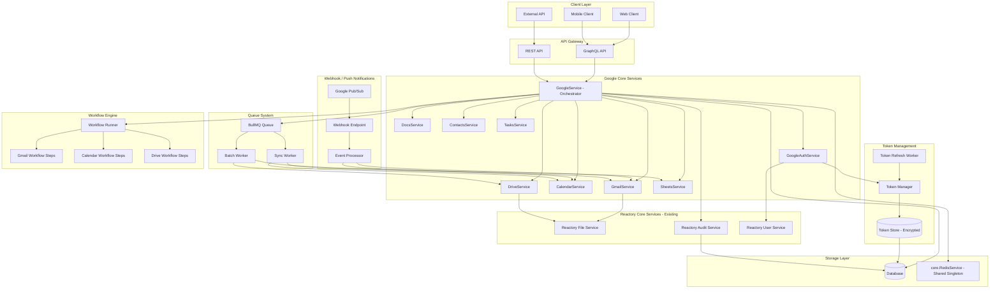

### 2.2 Module Structure

```
reactory-google/
├── index.ts                        # Module definition and exports
├── readme.md                       # Module overview
├── package.json                    # Module dependencies
│
├── docs/                           # Documentation
│   └── specification.md            # This document
│
├── services/                       # Core business logic
│   ├── index.ts                    # Service definitions array
│   ├── GoogleService.ts            # Main orchestrator service
│   ├── GoogleAuthService.ts        # OAuth 2.0 token management
│   ├── GmailService.ts             # Gmail API operations
│   ├── CalendarService.ts          # Calendar API operations
│   ├── DriveService.ts             # Drive API operations
│   ├── DocsService.ts              # Google Docs API operations
│   ├── SheetsService.ts            # Google Sheets API operations
│   ├── ContactsService.ts          # People API (Contacts) operations
│   ├── TasksService.ts             # Tasks API operations
│   └── GoogleAuditService.ts       # Google-specific audit wrapper
│
├── models/                         # Data models
│   ├── index.ts
│   ├── GoogleToken.ts              # OAuth token storage model
│   ├── GoogleSyncState.ts          # Sync state tracking model
│   ├── GoogleWebhookChannel.ts     # Push notification channel model
│   └── GoogleAuditLog.ts           # Google API audit log model
│
├── graphql/                        # GraphQL definitions
│   ├── index.ts
│   ├── types/
│   │   ├── index.ts
│   │   ├── auth.graphql            # Auth/token types
│   │   ├── gmail.graphql           # Gmail types
│   │   ├── calendar.graphql        # Calendar types
│   │   ├── drive.graphql           # Drive types
│   │   ├── docs.graphql            # Docs types
│   │   ├── sheets.graphql          # Sheets types
│   │   ├── contacts.graphql        # Contacts types
│   │   └── tasks.graphql           # Tasks types
│   └── resolvers/
│       ├── index.ts
│       ├── AuthResolver.ts
│       ├── GmailResolver.ts
│       ├── CalendarResolver.ts
│       ├── DriveResolver.ts
│       ├── DocsResolver.ts
│       ├── SheetsResolver.ts
│       ├── ContactsResolver.ts
│       └── TasksResolver.ts
│
├── forms/                          # Reactory form definitions
│   ├── index.ts
│   ├── GoogleAccountConnectionForm.ts  # OAuth connection UI
│   ├── GmailComposeForm.ts            # Email compose form
│   ├── GmailInboxForm.ts              # Inbox browser form
│   ├── CalendarEventForm.ts           # Calendar event CRUD form
│   ├── CalendarViewForm.ts            # Calendar view/browse form
│   ├── DriveExplorerForm.ts           # Drive file browser form
│   ├── DocumentEditorForm.ts          # Google Docs editor form
│   ├── SpreadsheetViewForm.ts         # Sheets viewer/editor form
│   ├── ContactsManagerForm.ts         # Contact management form
│   └── TasksManagerForm.ts            # Task management form
│
├── routes/                         # REST API routes
│   ├── index.ts
│   ├── auth.ts                     # OAuth callback and token routes
│   ├── webhooks.ts                 # Google Pub/Sub webhook receiver
│   └── proxy.ts                    # Attachment/file proxy routes
│
├── workflows/                      # Workflow definitions
│   ├── index.ts
│   ├── GmailSyncWorkflow.ts        # Gmail sync workflow
│   ├── CalendarSyncWorkflow.ts     # Calendar sync workflow
│   ├── DriveSyncWorkflow.ts        # Drive sync workflow
│   ├── SendEmailWorkflow.ts        # Email sending workflow step
│   └── CreateEventWorkflow.ts      # Calendar event creation workflow step
│
├── queues/                         # Queue job definitions
│   ├── index.ts
│   ├── GmailSyncQueue.ts           # Gmail sync jobs
│   ├── CalendarSyncQueue.ts        # Calendar sync jobs
│   ├── DriveSyncQueue.ts           # Drive sync jobs
│   ├── BatchOperationQueue.ts      # Batch Google API operations
│   └── TokenRefreshQueue.ts        # Automatic token refresh jobs
│
├── middleware/                     # Express middleware
│   ├── index.ts
│   ├── google-auth-check.ts        # Verify Google connection exists
│   └── webhook-verification.ts     # Verify Google webhook signatures
│
├── cli/                            # CLI commands
│   ├── index.ts
│   ├── auth-status.ts              # Check user auth status
│   ├── sync-gmail.ts               # Manual Gmail sync trigger
│   ├── sync-calendar.ts            # Manual Calendar sync trigger
│   └── list-connections.ts         # List connected Google accounts
│
├── types/                          # TypeScript type definitions
│   ├── index.ts
│   ├── google.types.ts             # Core Google types
│   ├── gmail.types.ts              # Gmail-specific types
│   ├── calendar.types.ts           # Calendar-specific types
│   ├── drive.types.ts              # Drive-specific types
│   ├── docs.types.ts               # Docs-specific types
│   ├── sheets.types.ts             # Sheets-specific types
│   ├── contacts.types.ts           # Contacts-specific types
│   └── tasks.types.ts              # Tasks-specific types
│
├── utils/                          # Utility functions
│   ├── index.ts
│   ├── token-encryption.ts         # Token encryption/decryption
│   ├── scope-helpers.ts            # OAuth scope management
│   ├── rate-limiter.ts             # Google API rate limiting
│   └── error-mapper.ts             # Map Google API errors to Reactory errors
│
├── ai/                             # AI capabilities (personas & macros)
│   ├── index.ts                    # Exports GOOGLE_MACROS and GoogleWorkspacePersona
│   ├── macros/
│   │   ├── index.ts                # Macro array and named exports
│   │   ├── SendEmailMacro.ts       # AI tool: send email via Gmail
│   │   ├── SearchEmailMacro.ts     # AI tool: search Gmail messages
│   │   ├── CreateEventMacro.ts     # AI tool: create Calendar event
│   │   ├── ListEventsMacro.ts      # AI tool: list upcoming Calendar events
│   │   ├── SearchDriveMacro.ts     # AI tool: search Drive files
│   │   ├── ReadSheetMacro.ts       # AI tool: read Sheets data
│   │   ├── CreateDocMacro.ts       # AI tool: create Google Doc
│   │   ├── ListContactsMacro.ts    # AI tool: list/search Contacts
│   │   ├── CreateTaskMacro.ts      # AI tool: create a Task
│   │   └── GetConnectionStatusMacro.ts  # AI tool: check Google connection
│   └── persona/
│       └── GoogleWorkspaceAssistant/
│           ├── agent.yaml          # IAIPersona YAML configuration
│           └── GoogleWorkspacePersona.ts  # TypeScript persona definition
│
├── data/                           # Static data and configurations
│   ├── scopes.json                 # Google OAuth scope definitions
│   └── api-quotas.json             # Google API quota limits reference
│
└── i18n/                           # Internationalization
    ├── en.json
    ├── af.json
    └── es.json
```

## 3. Core Components

### 3.1 Service Architecture

```mermaid
classDiagram
    class GoogleService {
        +getAuthService(): GoogleAuthService
        +getGmailService(): GmailService
        +getCalendarService(): CalendarService
        +getDriveService(): DriveService
        +getDocsService(): DocsService
        +getSheetsService(): SheetsService
        +getContactsService(): ContactsService
        +getTasksService(): TasksService
        +getConnectionStatus(userId): GoogleConnectionStatus
        +disconnectAccount(userId): void
    }

    class GoogleAuthService {
        +getAuthorizationUrl(userId, scopes): string
        +handleAuthCallback(code, state): GoogleToken
        +refreshAccessToken(userId): GoogleToken
        +revokeAccess(userId): void
        +getToken(userId): GoogleToken
        +hasValidToken(userId): boolean
        +getGrantedScopes(userId): string[]
        +requestAdditionalScopes(userId, scopes): string
        -encryptToken(token): string
        -decryptToken(encrypted): GoogleToken
        -validateScopes(required, granted): boolean
    }

    class GmailService {
        +listMessages(query, options): GmailMessageList
        +getMessage(messageId): GmailMessage
        +getThread(threadId): GmailThread
        +sendMessage(to, subject, body, options): GmailMessage
        +createDraft(to, subject, body, options): GmailDraft
        +updateDraft(draftId, data): GmailDraft
        +sendDraft(draftId): GmailMessage
        +deleteDraft(draftId): void
        +replyToMessage(messageId, body, options): GmailMessage
        +forwardMessage(messageId, to): GmailMessage
        +trashMessage(messageId): void
        +untrashMessage(messageId): void
        +batchModifyMessages(messageIds, addLabels, removeLabels): void
        +listLabels(): GmailLabel[]
        +createLabel(name, options): GmailLabel
        +deleteLabel(labelId): void
        +getAttachment(messageId, attachmentId): GmailAttachment
        +watchMailbox(topicName, labelIds): WatchResponse
        +stopWatch(): void
        +getProfile(): GmailProfile
    }

    class CalendarService {
        +listCalendars(): GoogleCalendar[]
        +getCalendar(calendarId): GoogleCalendar
        +createCalendar(name, options): GoogleCalendar
        +deleteCalendar(calendarId): void
        +listEvents(calendarId, timeMin, timeMax, options): CalendarEventList
        +getEvent(calendarId, eventId): CalendarEvent
        +createEvent(calendarId, event): CalendarEvent
        +updateEvent(calendarId, eventId, event): CalendarEvent
        +deleteEvent(calendarId, eventId): void
        +moveEvent(calendarId, eventId, destinationCalendarId): CalendarEvent
        +getFreeBusy(timeMin, timeMax, calendars): FreeBusyResponse
        +quickAddEvent(calendarId, text): CalendarEvent
        +listEventInstances(calendarId, eventId): CalendarEvent[]
        +watchEvents(calendarId): WatchResponse
    }

    class DriveService {
        +listFiles(query, options): DriveFileList
        +getFile(fileId): DriveFile
        +createFile(metadata, media): DriveFile
        +updateFile(fileId, metadata, media): DriveFile
        +deleteFile(fileId): void
        +moveFile(fileId, newParentId): DriveFile
        +copyFile(fileId, options): DriveFile
        +downloadFile(fileId): Buffer
        +exportFile(fileId, mimeType): Buffer
        +createFolder(name, parentId): DriveFile
        +listPermissions(fileId): DrivePermission[]
        +createPermission(fileId, permission): DrivePermission
        +deletePermission(fileId, permissionId): void
        +listRevisions(fileId): DriveRevision[]
        +listSharedDrives(): SharedDrive[]
        +searchFiles(query): DriveFileList
        +generateThumbnailLink(fileId): string
    }

    class DocsService {
        +getDocument(documentId): GoogleDoc
        +createDocument(title): GoogleDoc
        +batchUpdate(documentId, requests): BatchUpdateResponse
        +insertText(documentId, text, location): void
        +deleteContent(documentId, range): void
        +insertTable(documentId, rows, cols, location): void
        +insertImage(documentId, imageUri, location): void
        +replaceText(documentId, find, replace): void
        +updateParagraphStyle(documentId, range, style): void
        +getDocumentAsHTML(documentId): string
        +getDocumentAsPlainText(documentId): string
    }

    class SheetsService {
        +getSpreadsheet(spreadsheetId): GoogleSpreadsheet
        +createSpreadsheet(title, sheets): GoogleSpreadsheet
        +getValues(spreadsheetId, range): SheetValues
        +updateValues(spreadsheetId, range, values): UpdateResponse
        +appendValues(spreadsheetId, range, values): AppendResponse
        +batchGetValues(spreadsheetId, ranges): BatchGetResponse
        +batchUpdateValues(spreadsheetId, data): BatchUpdateResponse
        +clearValues(spreadsheetId, range): void
        +addSheet(spreadsheetId, title, options): Sheet
        +deleteSheet(spreadsheetId, sheetId): void
        +formatCells(spreadsheetId, sheetId, range, format): void
        +createNamedRange(spreadsheetId, name, range): NamedRange
        +getNamedRanges(spreadsheetId): NamedRange[]
    }

    class ContactsService {
        +listContacts(options): ContactList
        +getContact(resourceName): Contact
        +createContact(contact): Contact
        +updateContact(resourceName, contact): Contact
        +deleteContact(resourceName): void
        +searchContacts(query): ContactList
        +listContactGroups(): ContactGroup[]
        +createContactGroup(name): ContactGroup
        +deleteContactGroup(resourceName): void
        +addContactToGroup(contactResourceName, groupResourceName): void
        +removeContactFromGroup(contactResourceName, groupResourceName): void
        +searchDirectory(query): DirectorySearchResult
        +getOtherContacts(options): ContactList
    }

    class TasksService {
        +listTaskLists(): TaskList[]
        +getTaskList(taskListId): TaskList
        +createTaskList(title): TaskList
        +updateTaskList(taskListId, title): TaskList
        +deleteTaskList(taskListId): void
        +listTasks(taskListId, options): TaskItem[]
        +getTask(taskListId, taskId): TaskItem
        +createTask(taskListId, task): TaskItem
        +updateTask(taskListId, taskId, task): TaskItem
        +deleteTask(taskListId, taskId): void
        +completeTask(taskListId, taskId): TaskItem
        +moveTask(taskListId, taskId, parentId, previousId): TaskItem
        +clearCompleted(taskListId): void
    }

    class GoogleAuditService {
        +logApiCall(service, method, userId, request, response): void
        +logAuthEvent(userId, action, details): void
        +logWebhookEvent(service, payload): void
        +getApiUsageReport(userId, dateRange): ApiUsageReport
        -useReactoryAuditService()
    }

    GoogleService --> GoogleAuthService
    GoogleService --> GmailService
    GoogleService --> CalendarService
    GoogleService --> DriveService
    GoogleService --> DocsService
    GoogleService --> SheetsService
    GoogleService --> ContactsService
    GoogleService --> TasksService
    GoogleService --> GoogleAuditService
    GmailService --> GoogleAuthService
    CalendarService --> GoogleAuthService
    DriveService --> GoogleAuthService
    DocsService --> GoogleAuthService
    SheetsService --> GoogleAuthService
    ContactsService --> GoogleAuthService
    TasksService --> GoogleAuthService
```

### 3.2 Service Registration

Each service follows the Reactory `@service` decorator pattern:

```
Service FQN                                       Type          Lifecycle
────────────────────────────────────────────────  ────────────  ─────────
reactory-google.GoogleService@1.0.0               integration   singleton
reactory-google.GoogleAuthService@1.0.0           authentication singleton
reactory-google.GmailService@1.0.0                messaging     singleton
reactory-google.CalendarService@1.0.0             data          singleton
reactory-google.DriveService@1.0.0                storage       singleton
reactory-google.DocsService@1.0.0                 data          singleton
reactory-google.SheetsService@1.0.0               data          singleton
reactory-google.ContactsService@1.0.0             data          singleton
reactory-google.TasksService@1.0.0                data          singleton
reactory-google.GoogleAuditService@1.0.0          logging       singleton
```

**Dependency Graph:**

```
GoogleService
├── GoogleAuthService
│   ├── core.UserService@1.0.0
│   └── core.RedisService@1.0.0
├── GmailService
│   ├── GoogleAuthService
│   ├── core.ReactoryFileService@1.0.0
│   └── core.RedisService@1.0.0
├── CalendarService
│   ├── GoogleAuthService
│   └── core.RedisService@1.0.0
├── DriveService
│   ├── GoogleAuthService
│   ├── core.ReactoryFileService@1.0.0
│   └── core.RedisService@1.0.0
├── DocsService
│   └── GoogleAuthService
├── SheetsService
│   └── GoogleAuthService
├── ContactsService
│   ├── GoogleAuthService
│   └── core.RedisService@1.0.0
├── TasksService
│   ├── GoogleAuthService
│   └── core.RedisService@1.0.0
└── GoogleAuditService
    └── core.ReactoryAuditService@1.0.0
```

> **Important**: All caching operations use the existing `core.RedisService@1.0.0` singleton. No new Redis clients or ioredis instances are created within this module. Services that require caching declare `core.RedisService@1.0.0` as a dependency and use its `get`, `set`, `setJSON`, `getJSON`, `del`, `expire`, and `keys` methods for all cache operations.

## 4. Authentication & Authorization

### 4.1 OAuth 2.0 Flow

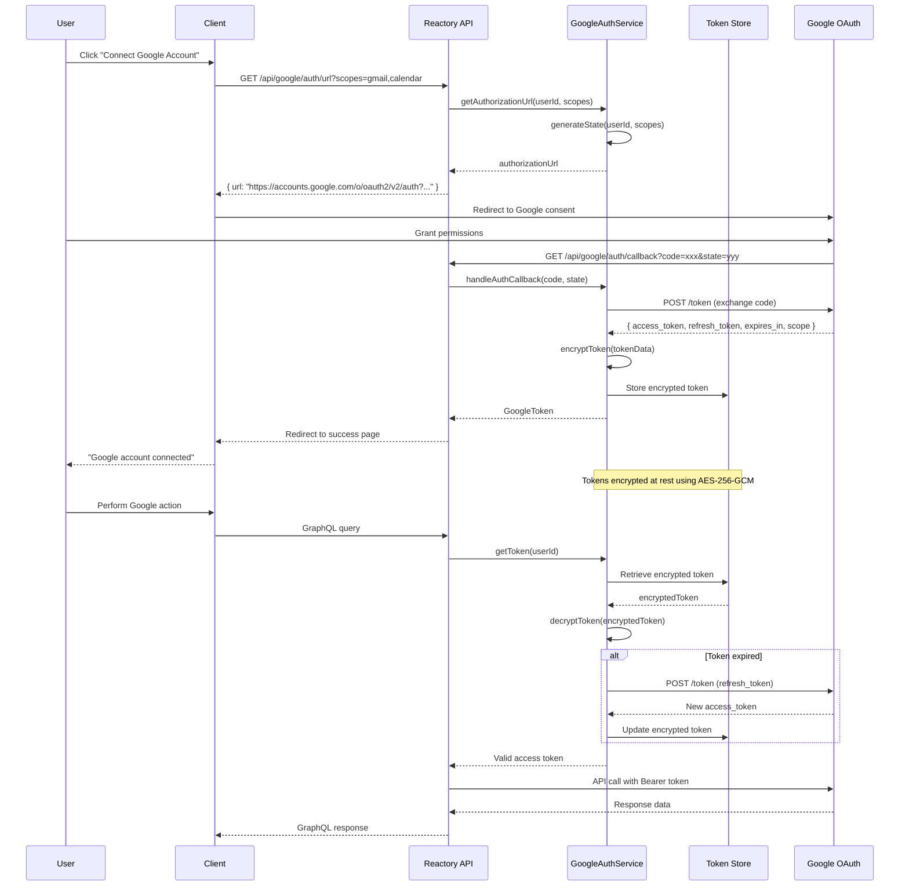

### 4.2 OAuth Scopes Management

The module uses incremental authorization — requesting only the scopes needed for the specific service being accessed:

| Service | OAuth Scopes |
|---|---|
| Gmail (read) | `https://www.googleapis.com/auth/gmail.readonly` |
| Gmail (full) | `https://www.googleapis.com/auth/gmail.modify`, `https://www.googleapis.com/auth/gmail.send` |
| Calendar | `https://www.googleapis.com/auth/calendar` |
| Drive | `https://www.googleapis.com/auth/drive` |
| Docs | `https://www.googleapis.com/auth/documents` |
| Sheets | `https://www.googleapis.com/auth/spreadsheets` |
| Contacts | `https://www.googleapis.com/auth/contacts` |
| Tasks | `https://www.googleapis.com/auth/tasks` |
| Profile | `https://www.googleapis.com/auth/userinfo.email`, `https://www.googleapis.com/auth/userinfo.profile` |

When a user attempts to access a service for which scopes have not been granted, the system presents an incremental consent flow requesting only the additional scopes required.

### 4.3 Token Storage Security

- Tokens encrypted at rest using AES-256-GCM
- Encryption key derived from a server-level secret (environment variable) combined with a per-user salt
- Refresh tokens stored separately from access tokens
- Token metadata (granted scopes, expiry) stored unencrypted for query efficiency
- Automatic token cleanup when user disconnects or revokes access
- Audit log entry for every token creation, refresh, and revocation

## 5. Service Specifications

### 5.1 Gmail Service

#### 5.1.1 Message Operations

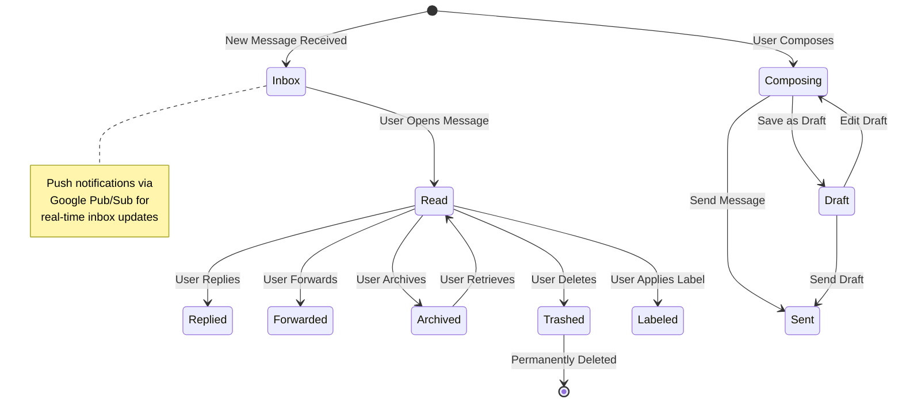

#### 5.1.2 Gmail Capabilities

- **Message listing**: Paginated, filterable by label, query string (Gmail search syntax), date range
- **Thread view**: Full conversation thread with all messages
- **Compose**: Rich text (HTML) and plain text message composition
- **Attachments**: Upload attachments via Reactory File Service, download attachments
- **Labels**: Full CRUD on custom labels, apply/remove labels on messages
- **Drafts**: Create, update, send, and delete drafts
- **Batch operations**: Batch modify labels, batch delete, batch archive
- **Push notifications**: Gmail mailbox watch via Pub/Sub for real-time updates
- **Profile**: Retrieve user email address, messages total, threads total, history ID

### 5.2 Calendar Service

#### 5.2.1 Event Lifecycle

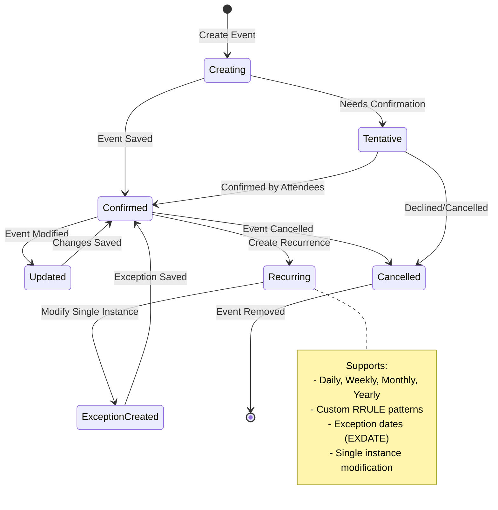

#### 5.2.2 Calendar Capabilities

- **Calendar management**: List, create, update, delete calendars; manage calendar metadata and color
- **Event CRUD**: Full create, read, update, delete with rich event properties
- **Recurring events**: RRULE-based recurrence with exceptions and instance overrides
- **Attendees**: Add/remove attendees, RSVP status tracking, send invitations
- **Reminders**: Default and per-event reminders (email, popup)
- **Free/busy queries**: Check availability across multiple calendars
- **Quick add**: Natural language event creation ("Lunch with Bob tomorrow at noon")
- **Event move**: Move events between calendars
- **Push notifications**: Calendar change notifications via Pub/Sub
- **Time zones**: Full time zone support for events and calendars

### 5.3 Drive Service

#### 5.3.1 Drive Capabilities

- **File browsing**: Paginated file listing with folder hierarchy, search, and sort
- **Upload/download**: Upload files to Drive; download or export files in various formats
- **Google Docs creation**: Create new Docs, Sheets, Slides, and Forms
- **Folder management**: Create, rename, move, and delete folders
- **Permissions**: Share files/folders with users, groups, domains, or public links; update/revoke permissions
- **Shared drives**: List and access shared (team) drives
- **Revisions**: List file revisions, revert to previous versions
- **File metadata**: Read/update file metadata, description, starring, trashing
- **File export**: Export Google Workspace files to PDF, DOCX, XLSX, CSV, etc.
- **Thumbnail generation**: Generate preview thumbnails for files
- **Storage quota**: Query user storage usage and quota

### 5.4 Docs Service

#### 5.4.1 Docs Capabilities

- **Document read**: Retrieve full document structure (body, headers, footers, footnotes)
- **Document creation**: Create new documents with initial content
- **Text insertion**: Insert text at specific locations (index, end of segment)
- **Text deletion**: Delete content by range
- **Find and replace**: Search and replace text across the document
- **Formatting**: Apply paragraph styles (heading levels, alignment, spacing), character styles (bold, italic, font, color)
- **Tables**: Insert, modify, and delete tables with cell-level operations
- **Images**: Insert inline images by URI
- **Lists**: Create and modify bulleted/numbered lists
- **Export**: Export document content as HTML or plain text
- **Batch updates**: Execute multiple document operations in a single API call

### 5.5 Sheets Service

#### 5.5.1 Sheets Capabilities

- **Spreadsheet management**: Create, retrieve, and update spreadsheet properties
- **Sheet management**: Add, rename, delete, duplicate individual sheets within a spreadsheet
- **Cell read/write**: Read and write cell values by range (A1 notation or R1C1)
- **Batch operations**: Read/write multiple ranges in a single request
- **Append data**: Append rows to the end of a table
- **Clear data**: Clear cell values in a specified range
- **Formatting**: Cell formatting (number format, font, color, borders, alignment)
- **Named ranges**: Create, update, delete, and list named ranges
- **Data validation**: Set data validation rules on cells
- **Conditional formatting**: Apply conditional formatting rules
- **Charts**: Read chart metadata (chart creation via batch update)
- **Filters**: Set and clear basic and advanced filters
- **Spreadsheet as data source**: Use spreadsheets as a lightweight data store for Reactory applications

### 5.6 Contacts Service

#### 5.6.1 Contacts Capabilities

- **Contact CRUD**: Create, read, update, and delete contacts
- **Contact search**: Search contacts by name, email, or phone
- **Contact fields**: Name, email addresses, phone numbers, addresses, organizations, birthdays, URLs, notes, custom fields
- **Contact photos**: Get and set contact photos
- **Contact groups**: Create, list, and delete contact groups; add/remove contacts from groups
- **Directory search**: Search the Google Workspace organization directory
- **Other contacts**: Access auto-saved contacts (people you have interacted with)
- **Merge contacts**: Identify and merge duplicate contacts
- **Sync**: Full and incremental sync with sync token support

### 5.7 Tasks Service

#### 5.7.1 Tasks Capabilities

- **Task list management**: Create, list, update, and delete task lists
- **Task CRUD**: Create, read, update, delete individual tasks
- **Task completion**: Mark tasks as complete/incomplete
- **Due dates**: Set and query due dates
- **Task ordering**: Reorder tasks, set parent/child relationships for subtasks
- **Clear completed**: Remove completed tasks from a list
- **Task notes**: Add detailed notes to tasks
- **Sync**: Incremental sync with API-provided sync mechanisms

## 6. Push Notifications & Webhooks

### 6.1 Push Notification Architecture

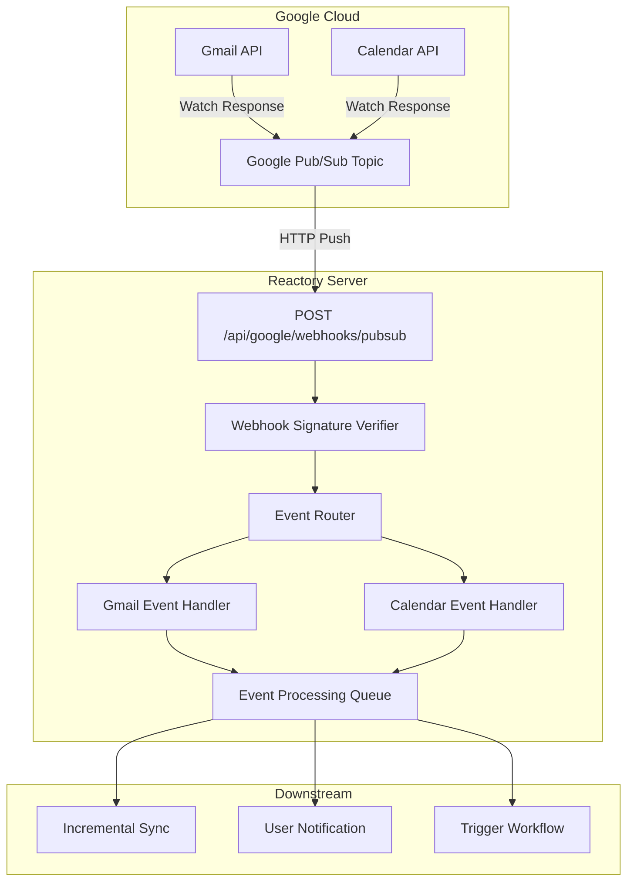

### 6.2 Watch Management

- Gmail watch channels expire after 7 days; a scheduled queue job renews them automatically
- Calendar watch channels expire after a configurable period; renewal is similarly automated
- Watch channels tracked in `GoogleWebhookChannel` model with userId, resourceId, channelId, expiration, and service type
- On user disconnect, all active watch channels are stopped via the respective API

## 7. Data Models

### 7.1 Core Data Model

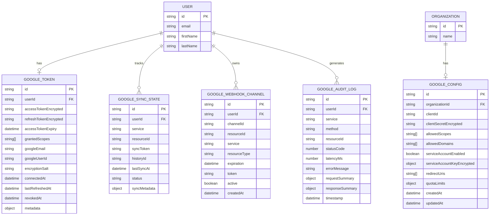

### 7.2 Google Connection States

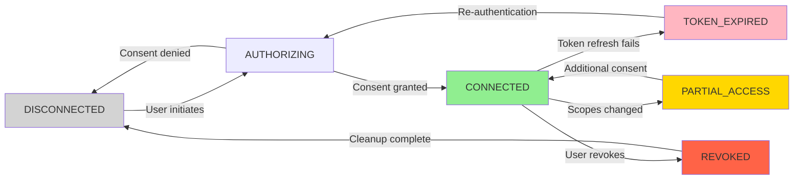

## 8. API Specifications

### 8.1 GraphQL Schema (Key Types)

```graphql
# ─── Auth Types ───────────────────────────────────

enum GoogleConnectionStatus {
  DISCONNECTED
  AUTHORIZING
  CONNECTED
  TOKEN_EXPIRED
  REVOKED
  PARTIAL_ACCESS
}

type GoogleConnection {
  userId: ID!
  googleEmail: String
  status: GoogleConnectionStatus!
  grantedScopes: [String!]!
  connectedAt: DateTime
  lastRefreshedAt: DateTime
}

# ─── Gmail Types ──────────────────────────────────

type GmailMessage {
  id: ID!
  threadId: String!
  labelIds: [String!]!
  snippet: String!
  from: EmailAddress!
  to: [EmailAddress!]!
  cc: [EmailAddress!]
  bcc: [EmailAddress!]
  subject: String!
  body: GmailBody!
  date: DateTime!
  isUnread: Boolean!
  isStarred: Boolean!
  attachments: [GmailAttachment!]
  headers: JSON
}

type GmailBody {
  plain: String
  html: String
}

type EmailAddress {
  name: String
  email: String!
}

type GmailAttachment {
  id: ID!
  filename: String!
  mimeType: String!
  size: Int!
}

type GmailThread {
  id: ID!
  messages: [GmailMessage!]!
  snippet: String!
  historyId: String!
}

type GmailLabel {
  id: ID!
  name: String!
  type: String!
  messagesTotal: Int
  messagesUnread: Int
  color: GmailLabelColor
}

type GmailLabelColor {
  textColor: String
  backgroundColor: String
}

type GmailDraft {
  id: ID!
  message: GmailMessage!
}

type GmailProfile {
  emailAddress: String!
  messagesTotal: Int!
  threadsTotal: Int!
  historyId: String!
}

type GmailMessageList {
  messages: [GmailMessage!]!
  nextPageToken: String
  resultSizeEstimate: Int!
}

# ─── Calendar Types ───────────────────────────────

type GoogleCalendar {
  id: ID!
  summary: String!
  description: String
  timeZone: String!
  backgroundColor: String
  foregroundColor: String
  selected: Boolean
  primary: Boolean
  accessRole: String!
}

type CalendarEvent {
  id: ID!
  calendarId: String!
  summary: String!
  description: String
  location: String
  start: EventDateTime!
  end: EventDateTime!
  status: EventStatus!
  creator: EventAttendee
  organizer: EventAttendee
  attendees: [EventAttendee!]
  recurrence: [String!]
  recurringEventId: String
  reminders: EventReminders
  colorId: String
  htmlLink: String!
  hangoutLink: String
  conferenceData: JSON
  visibility: EventVisibility
  created: DateTime!
  updated: DateTime!
}

type EventDateTime {
  dateTime: DateTime
  date: String
  timeZone: String
}

enum EventStatus {
  CONFIRMED
  TENTATIVE
  CANCELLED
}

enum EventVisibility {
  DEFAULT
  PUBLIC
  PRIVATE
  CONFIDENTIAL
}

type EventAttendee {
  email: String!
  displayName: String
  responseStatus: AttendeeResponseStatus
  self: Boolean
  organizer: Boolean
  optional: Boolean
}

enum AttendeeResponseStatus {
  NEEDS_ACTION
  DECLINED
  TENTATIVE
  ACCEPTED
}

type EventReminders {
  useDefault: Boolean!
  overrides: [ReminderOverride!]
}

type ReminderOverride {
  method: String!
  minutes: Int!
}

type FreeBusyResponse {
  calendars: JSON!
  timeMin: DateTime!
  timeMax: DateTime!
}

type CalendarEventList {
  events: [CalendarEvent!]!
  nextPageToken: String
  nextSyncToken: String
}

# ─── Drive Types ──────────────────────────────────

type DriveFile {
  id: ID!
  name: String!
  mimeType: String!
  description: String
  starred: Boolean
  trashed: Boolean
  parents: [String!]
  webViewLink: String
  webContentLink: String
  iconLink: String
  thumbnailLink: String
  size: String
  createdTime: DateTime
  modifiedTime: DateTime
  owners: [DriveUser!]
  lastModifyingUser: DriveUser
  shared: Boolean
  permissions: [DrivePermission!]
}

type DriveUser {
  displayName: String!
  emailAddress: String
  photoLink: String
}

type DrivePermission {
  id: ID!
  type: String!
  role: String!
  emailAddress: String
  displayName: String
  domain: String
}

type DriveFileList {
  files: [DriveFile!]!
  nextPageToken: String
}

type SharedDrive {
  id: ID!
  name: String!
  colorRgb: String
  createdTime: DateTime
}

# ─── Sheets Types ─────────────────────────────────

type GoogleSpreadsheet {
  spreadsheetId: ID!
  title: String!
  locale: String
  sheets: [Sheet!]!
  namedRanges: [NamedRange!]
  spreadsheetUrl: String!
}

type Sheet {
  sheetId: Int!
  title: String!
  index: Int!
  sheetType: String!
  rowCount: Int
  columnCount: Int
}

type SheetValues {
  range: String!
  majorDimension: String!
  values: [[String]]!
}

type NamedRange {
  namedRangeId: String!
  name: String!
  range: GridRange!
}

type GridRange {
  sheetId: Int!
  startRowIndex: Int
  endRowIndex: Int
  startColumnIndex: Int
  endColumnIndex: Int
}

# ─── Contacts Types ──────────────────────────────

type GoogleContact {
  resourceName: String!
  etag: String
  names: [ContactName!]
  emailAddresses: [ContactEmailAddress!]
  phoneNumbers: [ContactPhoneNumber!]
  addresses: [ContactAddress!]
  organizations: [ContactOrganization!]
  birthdays: [ContactBirthday!]
  urls: [ContactUrl!]
  photos: [ContactPhoto!]
  biographies: [ContactBiography!]
  metadata: ContactMetadata
}

type ContactName {
  displayName: String!
  givenName: String
  familyName: String
  middleName: String
}

type ContactEmailAddress {
  value: String!
  type: String
  formattedType: String
}

type ContactPhoneNumber {
  value: String!
  type: String
  formattedType: String
}

type ContactAddress {
  formattedValue: String
  type: String
  streetAddress: String
  city: String
  region: String
  postalCode: String
  country: String
  countryCode: String
}

type ContactOrganization {
  name: String
  title: String
  department: String
  type: String
}

type ContactBirthday {
  date: DateValue
  text: String
}

type DateValue {
  year: Int
  month: Int
  day: Int
}

type ContactUrl {
  value: String!
  type: String
}

type ContactPhoto {
  url: String!
  default: Boolean
}

type ContactBiography {
  value: String!
  contentType: String
}

type ContactMetadata {
  sources: [ContactSource!]
}

type ContactSource {
  type: String!
  id: String!
}

type ContactGroup {
  resourceName: String!
  name: String!
  groupType: String!
  memberCount: Int!
}

type ContactList {
  contacts: [GoogleContact!]!
  nextPageToken: String
  totalItems: Int
  nextSyncToken: String
}

# ─── Tasks Types ─────────────────────────────────

type GoogleTaskList {
  id: ID!
  title: String!
  updated: DateTime
  selfLink: String
}

type GoogleTask {
  id: ID!
  title: String!
  notes: String
  status: TaskStatus!
  due: DateTime
  completed: DateTime
  parent: String
  position: String
  links: [TaskLink!]
  updated: DateTime
}

enum TaskStatus {
  NEEDS_ACTION
  COMPLETED
}

type TaskLink {
  type: String!
  description: String
  link: String!
}

# ─── Docs Types ──────────────────────────────────

type GoogleDoc {
  documentId: ID!
  title: String!
  revisionId: String!
  body: JSON
  headers: JSON
  footers: JSON
  footnotes: JSON
}

# ─── Queries ─────────────────────────────────────

type Query {
  # Auth
  googleConnectionStatus: GoogleConnection!
  googleAuthUrl(scopes: [String!]!): String!

  # Gmail
  gmailProfile: GmailProfile!
  gmailMessages(query: String, labelIds: [String!], maxResults: Int, pageToken: String): GmailMessageList!
  gmailMessage(id: ID!): GmailMessage!
  gmailThread(id: ID!): GmailThread!
  gmailLabels: [GmailLabel!]!
  gmailDrafts(maxResults: Int, pageToken: String): [GmailDraft!]!

  # Calendar
  googleCalendars: [GoogleCalendar!]!
  googleCalendar(calendarId: ID!): GoogleCalendar!
  calendarEvents(
    calendarId: ID!
    timeMin: DateTime
    timeMax: DateTime
    query: String
    maxResults: Int
    pageToken: String
    singleEvents: Boolean
    orderBy: String
  ): CalendarEventList!
  calendarEvent(calendarId: ID!, eventId: ID!): CalendarEvent!
  calendarFreeBusy(timeMin: DateTime!, timeMax: DateTime!, calendarIds: [ID!]!): FreeBusyResponse!

  # Drive
  driveFiles(
    query: String
    folderId: ID
    mimeType: String
    maxResults: Int
    pageToken: String
    orderBy: String
  ): DriveFileList!
  driveFile(fileId: ID!): DriveFile!
  driveSharedDrives: [SharedDrive!]!

  # Docs
  googleDoc(documentId: ID!): GoogleDoc!

  # Sheets
  googleSpreadsheet(spreadsheetId: ID!): GoogleSpreadsheet!
  sheetValues(spreadsheetId: ID!, range: String!): SheetValues!

  # Contacts
  googleContacts(
    query: String
    pageSize: Int
    pageToken: String
    syncToken: String
  ): ContactList!
  googleContact(resourceName: String!): GoogleContact!
  googleContactGroups: [ContactGroup!]!

  # Tasks
  googleTaskLists: [GoogleTaskList!]!
  googleTasks(
    taskListId: ID!
    showCompleted: Boolean
    showHidden: Boolean
    maxResults: Int
    pageToken: String
  ): [GoogleTask!]!
  googleTask(taskListId: ID!, taskId: ID!): GoogleTask!
}

# ─── Mutations ───────────────────────────────────

type Mutation {
  # Auth
  googleDisconnect: Boolean!
  googleRequestAdditionalScopes(scopes: [String!]!): String!

  # Gmail
  gmailSendMessage(
    to: [String!]!
    subject: String!
    body: String!
    cc: [String!]
    bcc: [String!]
    isHtml: Boolean
    attachmentFileIds: [ID!]
    inReplyTo: ID
    threadId: ID
  ): GmailMessage!

  gmailCreateDraft(
    to: [String!]
    subject: String
    body: String
    cc: [String!]
    bcc: [String!]
    isHtml: Boolean
  ): GmailDraft!

  gmailUpdateDraft(draftId: ID!, to: [String!], subject: String, body: String): GmailDraft!
  gmailSendDraft(draftId: ID!): GmailMessage!
  gmailDeleteDraft(draftId: ID!): Boolean!
  gmailTrashMessage(messageId: ID!): Boolean!
  gmailUntrashMessage(messageId: ID!): Boolean!
  gmailModifyMessage(messageId: ID!, addLabelIds: [String!], removeLabelIds: [String!]): GmailMessage!
  gmailBatchModifyMessages(messageIds: [ID!]!, addLabelIds: [String!], removeLabelIds: [String!]): Boolean!
  gmailCreateLabel(name: String!, backgroundColor: String, textColor: String): GmailLabel!
  gmailDeleteLabel(labelId: ID!): Boolean!

  # Calendar
  calendarCreateEvent(calendarId: ID!, event: CalendarEventInput!): CalendarEvent!
  calendarUpdateEvent(calendarId: ID!, eventId: ID!, event: CalendarEventInput!): CalendarEvent!
  calendarDeleteEvent(calendarId: ID!, eventId: ID!): Boolean!
  calendarMoveEvent(calendarId: ID!, eventId: ID!, destinationCalendarId: ID!): CalendarEvent!
  calendarQuickAddEvent(calendarId: ID!, text: String!): CalendarEvent!
  calendarCreateCalendar(summary: String!, description: String, timeZone: String): GoogleCalendar!
  calendarDeleteCalendar(calendarId: ID!): Boolean!

  # Drive
  driveCreateFolder(name: String!, parentId: ID): DriveFile!
  driveUploadFile(name: String!, mimeType: String!, parentId: ID, fileId: ID!): DriveFile!
  driveUpdateFile(fileId: ID!, name: String, description: String, starred: Boolean): DriveFile!
  driveDeleteFile(fileId: ID!): Boolean!
  driveMoveFile(fileId: ID!, newParentId: ID!): DriveFile!
  driveCopyFile(fileId: ID!, name: String, parentId: ID): DriveFile!
  driveCreatePermission(fileId: ID!, type: String!, role: String!, emailAddress: String, domain: String): DrivePermission!
  driveDeletePermission(fileId: ID!, permissionId: ID!): Boolean!

  # Docs
  googleDocCreate(title: String!): GoogleDoc!
  googleDocInsertText(documentId: ID!, text: String!, index: Int!): GoogleDoc!
  googleDocReplaceText(documentId: ID!, find: String!, replace: String!): GoogleDoc!
  googleDocBatchUpdate(documentId: ID!, requests: JSON!): JSON!

  # Sheets
  googleSpreadsheetCreate(title: String!, sheetTitles: [String!]): GoogleSpreadsheet!
  sheetUpdateValues(spreadsheetId: ID!, range: String!, values: [[String]]!): JSON!
  sheetAppendValues(spreadsheetId: ID!, range: String!, values: [[String]]!): JSON!
  sheetClearValues(spreadsheetId: ID!, range: String!): Boolean!
  sheetAddSheet(spreadsheetId: ID!, title: String!): Sheet!
  sheetDeleteSheet(spreadsheetId: ID!, sheetId: Int!): Boolean!

  # Contacts
  googleContactCreate(contact: GoogleContactInput!): GoogleContact!
  googleContactUpdate(resourceName: String!, contact: GoogleContactInput!): GoogleContact!
  googleContactDelete(resourceName: String!): Boolean!
  googleContactGroupCreate(name: String!): ContactGroup!
  googleContactGroupDelete(resourceName: String!): Boolean!

  # Tasks
  googleTaskListCreate(title: String!): GoogleTaskList!
  googleTaskListUpdate(taskListId: ID!, title: String!): GoogleTaskList!
  googleTaskListDelete(taskListId: ID!): Boolean!
  googleTaskCreate(taskListId: ID!, title: String!, notes: String, due: DateTime, parent: String): GoogleTask!
  googleTaskUpdate(taskListId: ID!, taskId: ID!, title: String, notes: String, due: DateTime, status: TaskStatus): GoogleTask!
  googleTaskDelete(taskListId: ID!, taskId: ID!): Boolean!
  googleTaskComplete(taskListId: ID!, taskId: ID!): GoogleTask!
  googleTaskClearCompleted(taskListId: ID!): Boolean!
  googleTaskMove(taskListId: ID!, taskId: ID!, parent: String, previous: String): GoogleTask!
}

# ─── Subscriptions ───────────────────────────────

type Subscription {
  gmailInboxUpdated: GmailMessage!
  calendarEventChanged(calendarId: ID!): CalendarEvent!
}

# ─── Input Types ─────────────────────────────────

input CalendarEventInput {
  summary: String!
  description: String
  location: String
  start: EventDateTimeInput!
  end: EventDateTimeInput!
  attendees: [EventAttendeeInput!]
  recurrence: [String!]
  reminders: EventRemindersInput
  colorId: String
  visibility: EventVisibility
}

input EventDateTimeInput {
  dateTime: DateTime
  date: String
  timeZone: String
}

input EventAttendeeInput {
  email: String!
  displayName: String
  optional: Boolean
}

input EventRemindersInput {
  useDefault: Boolean!
  overrides: [ReminderOverrideInput!]
}

input ReminderOverrideInput {
  method: String!
  minutes: Int!
}

input GoogleContactInput {
  givenName: String
  familyName: String
  middleName: String
  emailAddresses: [ContactEmailInput!]
  phoneNumbers: [ContactPhoneInput!]
  addresses: [ContactAddressInput!]
  organizations: [ContactOrganizationInput!]
  notes: String
}

input ContactEmailInput {
  value: String!
  type: String
}

input ContactPhoneInput {
  value: String!
  type: String
}

input ContactAddressInput {
  streetAddress: String
  city: String
  region: String
  postalCode: String
  country: String
  type: String
}

input ContactOrganizationInput {
  name: String
  title: String
  department: String
}
```

### 8.2 REST API Endpoints

```
# Authentication Endpoints
GET    /api/google/auth/url                     # Get OAuth authorization URL
GET    /api/google/auth/callback                # OAuth callback (redirect from Google)
POST   /api/google/auth/disconnect              # Disconnect Google account
GET    /api/google/auth/status                  # Get connection status

# Webhook Endpoints
POST   /api/google/webhooks/pubsub              # Google Pub/Sub push endpoint
POST   /api/google/webhooks/calendar/:channelId # Calendar push notification endpoint

# Proxy Endpoints (for attachments/file downloads)
GET    /api/google/gmail/attachment/:messageId/:attachmentId  # Download Gmail attachment
GET    /api/google/drive/download/:fileId                      # Download Drive file
GET    /api/google/drive/export/:fileId/:mimeType              # Export Google Workspace file
GET    /api/google/drive/thumbnail/:fileId                     # Get file thumbnail
```

## 9. Workflow Integration

### 9.1 Gmail Sync Workflow

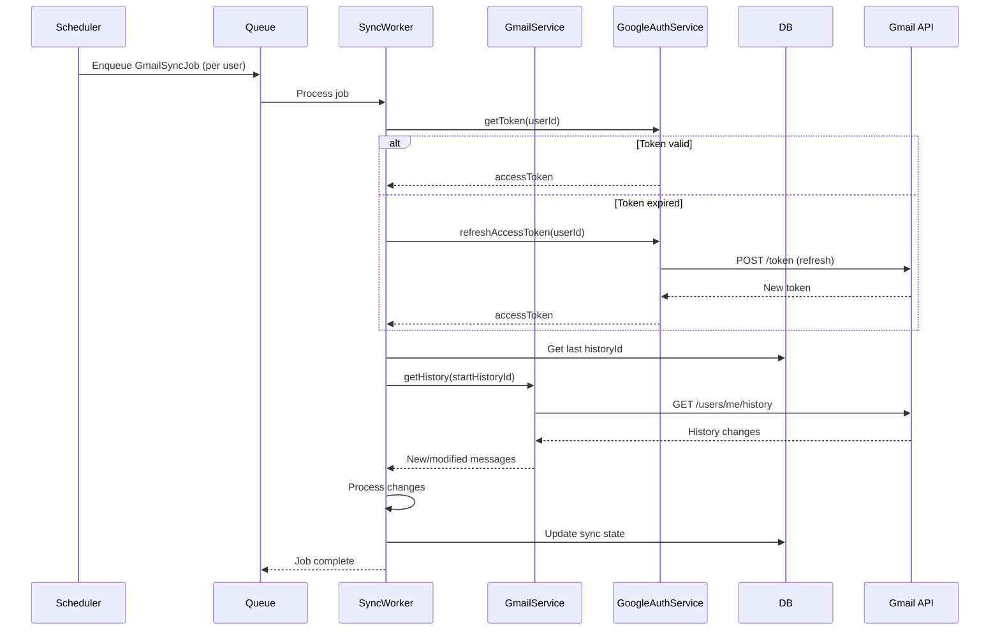

### 9.2 Workflow Step Examples

The Google module exposes reusable workflow steps that can be composed into larger Reactory workflows:

| Workflow Step | Description | Input | Output |
|---|---|---|---|
| `google.SendEmail` | Send an email via Gmail | to, subject, body, cc, bcc, attachments | GmailMessage |
| `google.CreateCalendarEvent` | Create a calendar event | calendarId, event details | CalendarEvent |
| `google.UploadToDrive` | Upload a file to Drive | fileId, folderId, name | DriveFile |
| `google.ReadSheet` | Read data from a sheet | spreadsheetId, range | SheetValues |
| `google.WriteSheet` | Write data to a sheet | spreadsheetId, range, values | UpdateResponse |
| `google.CreateDocument` | Create a Google Doc | title, content | GoogleDoc |
| `google.CreateContact` | Create a contact | contact details | GoogleContact |
| `google.CreateTask` | Create a task | taskListId, title, due | GoogleTask |

## 10. Queue-Based Processing

### 10.1 Queue Architecture

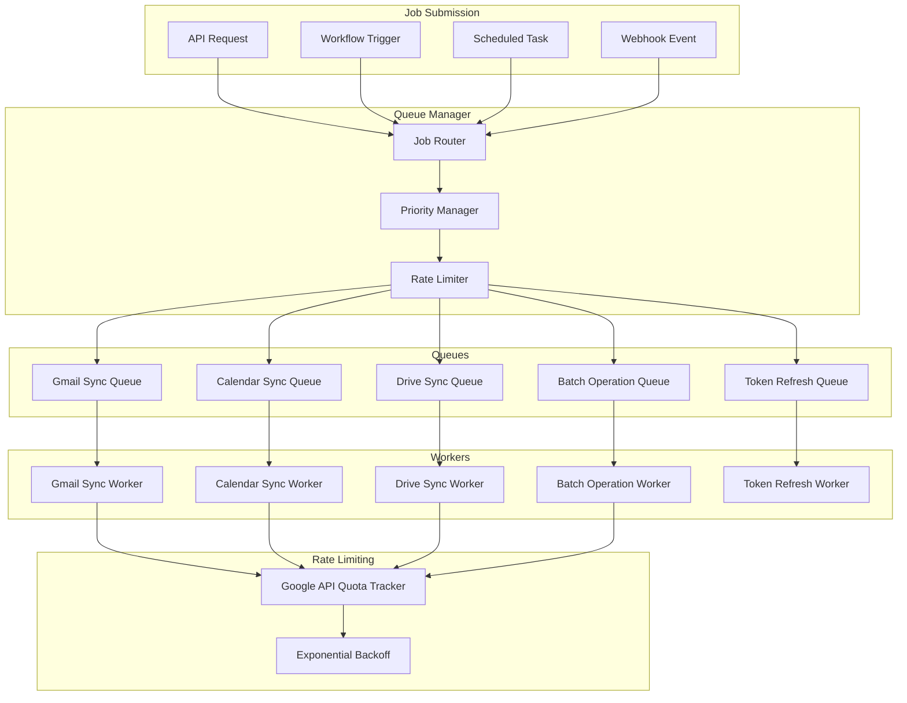

### 10.2 Queue Job Types

| Job Type | Queue | Purpose | Schedule |
|---|---|---|---|
| `GmailSyncJob` | Gmail Sync | Incremental Gmail sync per user | On webhook / every 15 min |
| `CalendarSyncJob` | Calendar Sync | Incremental Calendar sync per user | On webhook / every 15 min |
| `DriveSyncJob` | Drive Sync | Drive change tracking per user | Every 30 min |
| `BatchReadJob` | Batch Operations | Batch read from Sheets/Drive | On demand |
| `BatchWriteJob` | Batch Operations | Batch write to Sheets/Drive | On demand |
| `TokenRefreshJob` | Token Refresh | Proactive token refresh before expiry | Every 45 min |
| `WatchRenewalJob` | Gmail Sync | Renew Gmail/Calendar push watches | Every 6 days |

### 10.3 Rate Limiting Strategy

Google APIs enforce per-user and per-project quota limits. The module implements:

- **Per-user rate limiting**: Track API calls per user per service via `core.RedisService@1.0.0`; throttle when approaching limits
- **Per-project rate limiting**: Global quota tracking across all users via `core.RedisService@1.0.0`
- **Exponential backoff**: On `429 Too Many Requests` or `503 Service Unavailable` responses
- **Batch request grouping**: Combine multiple operations into Google Batch API calls where supported
- **Priority queuing**: User-initiated requests prioritized over background sync

## 11. Security & Compliance

### 11.1 Security Measures

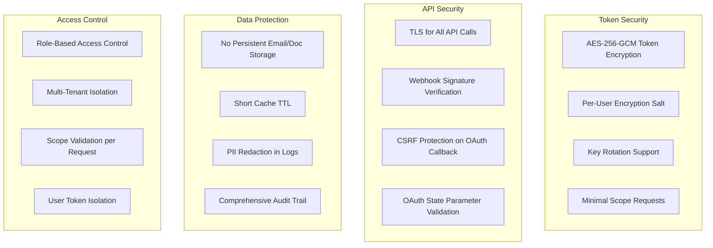

### 11.2 Data Handling Principles

- **Pass-through model**: The module proxies Google API data to the client without persisting email bodies, document content, or calendar details in the Reactory database
- **Cached data**: Metadata (labels, calendar list, drive structure) may be cached via `core.RedisService@1.0.0` with short TTL for performance; cache invalidated on change notifications. No separate Redis client is instantiated.
- **Token storage**: Only OAuth tokens and sync state are persisted in the database, encrypted at rest
- **Audit logging**: API call metadata (service, method, status code, latency) is logged; request/response bodies are NOT logged to avoid PII leakage
- **User isolation**: Each user's Google data is strictly scoped to their own OAuth token; service accounts used only for organization-level operations where explicitly configured

### 11.3 Compliance Considerations

- **GDPR**: Users can disconnect their Google account at any time, which triggers deletion of all stored tokens, sync state, and cached data
- **OAuth best practices**: Follow Google's OAuth 2.0 policies including verification, minimal scopes, and user consent
- **Google API Terms of Service**: Comply with Google API Services User Data Policy (limited use requirements)
- **Data residency**: No Google user data (emails, documents, events) stored permanently on Reactory servers

## 12. Performance & Scalability

### 12.1 Performance Targets

| Operation | Target | Notes |
|---|---|---|
| OAuth flow completion | < 2s (server-side) | Excludes user consent time |
| Gmail message list | < 1s | Paginated, max 50 results |
| Gmail message detail | < 500ms | Single message with body |
| Send email | < 2s | Including attachment upload |
| Calendar event list | < 1s | Paginated, time-bounded |
| Calendar event create | < 1s | Single event |
| Drive file list | < 1s | Paginated, max 100 results |
| Drive file upload | < 5s | For files up to 10MB |
| Sheets read values | < 1s | For ranges up to 10,000 cells |
| Sheets write values | < 2s | For ranges up to 10,000 cells |
| Contact list | < 1s | Paginated, max 100 results |
| Token refresh | < 500ms | Background operation |

### 12.2 Caching Strategy

All cache operations are performed via the existing `core.RedisService@1.0.0` singleton (injected as a dependency). No new Redis clients are created.

Cache keys are namespaced with `google:{userId}:{service}:` to avoid collisions (e.g. `google:user123:gmail:labels`).

| Data Type | Cache Via | TTL | Invalidation |
|---|---|---|---|
| Gmail labels | `core.RedisService@1.0.0` | 5 min | On label mutation |
| Calendar list | `core.RedisService@1.0.0` | 10 min | On calendar mutation |
| Drive folder structure | `core.RedisService@1.0.0` | 5 min | On file/folder mutation |
| Contact groups | `core.RedisService@1.0.0` | 15 min | On group mutation |
| Task lists | `core.RedisService@1.0.0` | 10 min | On task list mutation |
| OAuth token metadata | `core.RedisService@1.0.0` | Until expiry | On token refresh/revoke |
| API quota counters | `core.RedisService@1.0.0` | 1 min sliding window | Auto-expire |

### 12.3 Scalability Strategy

- **Horizontal scaling**: All services are stateless; token retrieval and caching via the shared `core.RedisService@1.0.0` singleton and database
- **Queue worker scaling**: Queue workers scale independently per queue based on backlog
- **Connection pooling**: Google API client instances pooled per user with automatic recycling
- **Batch API usage**: Combine multiple Google API calls into batch requests where supported
- **Incremental sync**: Use sync tokens and history IDs to minimize data transfer
- **No duplicate Redis connections**: All modules share the single `core.RedisService@1.0.0` ioredis connection, avoiding connection pool exhaustion

## 13. Configuration

### 13.1 Module Configuration

```typescript
interface GoogleModuleConfig {
  oauth: {
    clientId: string;
    clientSecret: string;
    redirectUri: string;
    scopes: {
      default: string[];         // Scopes requested on initial connect
      gmail: string[];
      calendar: string[];
      drive: string[];
      docs: string[];
      sheets: string[];
      contacts: string[];
      tasks: string[];
    };
  };
  encryption: {
    tokenEncryptionKey: string;  // AES-256 key (from environment variable)
    algorithm: string;           // Default: 'aes-256-gcm'
  };
  pubsub: {
    enabled: boolean;
    projectId: string;
    topicName: string;
    subscriptionName: string;
    verificationToken: string;
  };
  sync: {
    enabled: boolean;
    gmailIntervalMinutes: number;
    calendarIntervalMinutes: number;
    driveIntervalMinutes: number;
    tokenRefreshIntervalMinutes: number;
    watchRenewalDays: number;
  };
  rateLimiting: {
    perUserPerMinute: number;
    perProjectPerMinute: number;
    backoffBaseMs: number;
    backoffMaxMs: number;
    maxRetries: number;
  };
  cache: {
    enabled: boolean;
    keyPrefix: string;            // Default: 'google' — all keys namespaced as {prefix}:{userId}:{service}:{key}
    ttl: {
      gmailLabels: number;
      calendarList: number;
      driveFolders: number;
      contactGroups: number;
      taskLists: number;
    };
    // NOTE: No Redis client configuration here — caching uses core.RedisService@1.0.0
  };
  queues: {
    gmailSync: QueueConfig;
    calendarSync: QueueConfig;
    driveSync: QueueConfig;
    batchOperations: QueueConfig;
    tokenRefresh: QueueConfig;
  };
  serviceAccount: {
    enabled: boolean;
    keyFile: string;              // Path to service account JSON key
    delegatedUser: string;        // Admin user for domain-wide delegation
    allowedDomains: string[];
  };
}
```

### 13.2 Environment Variables

```bash
# OAuth 2.0 Credentials
GOOGLE_CLIENT_ID=                     # Google Cloud Console OAuth client ID
GOOGLE_CLIENT_SECRET=                 # Google Cloud Console OAuth client secret
GOOGLE_REDIRECT_URI=                  # OAuth callback URL

# Token Encryption
GOOGLE_TOKEN_ENCRYPTION_KEY=          # AES-256 encryption key for token storage

# Pub/Sub Configuration
GOOGLE_PUBSUB_PROJECT_ID=            # Google Cloud project ID
GOOGLE_PUBSUB_TOPIC=                 # Pub/Sub topic name for push notifications
GOOGLE_PUBSUB_VERIFICATION_TOKEN=    # Webhook verification token

# Service Account (optional)
GOOGLE_SERVICE_ACCOUNT_KEY_FILE=     # Path to service account JSON key
GOOGLE_DELEGATED_USER=               # Admin user for domain-wide delegation

# Rate Limiting
GOOGLE_RATE_LIMIT_PER_USER=100       # Max API calls per user per minute
GOOGLE_RATE_LIMIT_PER_PROJECT=1000   # Max API calls per project per minute
```

## 14. Forms Specification

### 14.1 Reactory Forms

The module provides schema-driven Reactory forms for end-user interaction with Google services:

| Form | Purpose | Key Features |
|---|---|---|
| `GoogleAccountConnectionForm` | OAuth connection management | Connect/disconnect, scope management, connection status |
| `GmailInboxForm` | Browse Gmail inbox | Message list, search, labels, thread view, pagination |
| `GmailComposeForm` | Compose/reply/forward emails | To/CC/BCC, subject, rich text body, attachments, draft save |
| `CalendarViewForm` | Calendar view with events | Month/week/day views, event preview, date navigation |
| `CalendarEventForm` | Create/edit calendar events | Event details, attendees, recurrence, reminders, time zones |
| `DriveExplorerForm` | Browse Google Drive files | Folder navigation, file list, upload, download, share, search |
| `DocumentEditorForm` | View/edit Google Docs | Document content display, basic editing operations |
| `SpreadsheetViewForm` | View/edit Google Sheets | Grid display, cell editing, sheet tabs, named ranges |
| `ContactsManagerForm` | Manage Google Contacts | Contact list, search, create/edit, groups, directory |
| `TasksManagerForm` | Manage Google Tasks | Task lists, task CRUD, due dates, completion, ordering |

### 14.2 Form Dependencies

All Google forms depend on the `GoogleAccountConnectionForm` completing successfully — i.e. the user must have a connected Google account with the appropriate scopes before any service-specific form loads data.

## 15. Testing Strategy

### 15.1 Test Coverage

- **Unit Tests**: All services, utilities, and token management (>85% coverage)
- **Integration Tests**: OAuth flow, API operations with mocked Google responses, webhook handling
- **E2E Tests**: Complete workflows from OAuth connection through service operations
- **Security Tests**: Token encryption/decryption, scope validation, webhook verification
- **Rate Limit Tests**: Quota enforcement, backoff behavior, recovery
- **Cache Tests**: Cache hit/miss, TTL expiry, invalidation

### 15.2 Test Scenarios

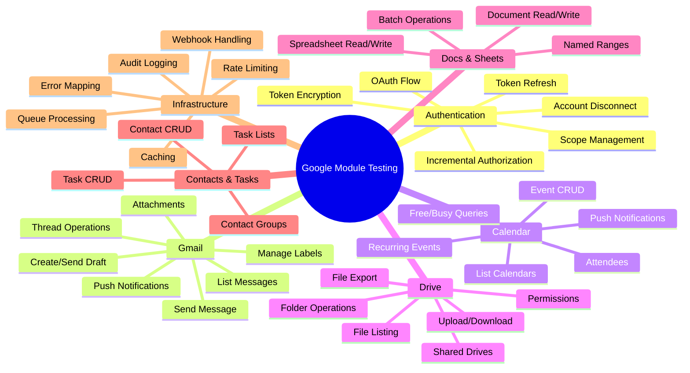

### 15.3 Mock Strategy

Google API responses are mocked using fixtures based on actual API response shapes from Google's documentation. Each service has a corresponding mock factory:

- `__mocks__/gmail.mock.ts` — Gmail API response fixtures
- `__mocks__/calendar.mock.ts` — Calendar API response fixtures
- `__mocks__/drive.mock.ts` — Drive API response fixtures
- etc.

Integration tests use `nock` or similar HTTP interceptor to mock Google API endpoints while testing full service logic including token management and error handling.

## 16. Monitoring & Observability

### 16.1 Metrics

- **Authentication Metrics**: Active connections, token refresh success/failure rate, OAuth flow completion rate
- **API Metrics**: Calls per service per minute, latency percentiles (p50, p95, p99), error rates by status code
- **Quota Metrics**: API quota usage per user, per project; rate limit hits; backoff events
- **Sync Metrics**: Sync completion rate, sync latency, changes processed per sync cycle
- **Queue Metrics**: Job counts by type, processing time, retry rate, dead letter count
- **Cache Metrics**: Hit ratio, miss ratio, eviction rate

### 16.2 Logging

- **Structured Logging**: JSON format for all log entries
- **Log Levels**: DEBUG (API call details), INFO (operations), WARN (rate limits, token issues), ERROR (failures), CRITICAL (auth system failures)
- **Sensitive Data**: Request/response bodies are NOT logged; only metadata (service, method, status, latency)
- **Correlation IDs**: Each API operation chain carries a correlation ID for traceability

### 16.3 Health Checks

- **Token health**: Percentage of active tokens that are valid (not expired, not revoked)
- **API connectivity**: Periodic lightweight API call to verify Google API reachability
- **Queue health**: Queue depth, processing rate, dead letter queue size
- **Cache health**: Delegates to `core.RedisService@1.0.0` health check (`isHealthy()` / `ping`)

## 17. Deployment

### 17.1 Google Cloud Console Setup

Before deployment, the following must be configured in the Google Cloud Console:

1. **Create OAuth 2.0 Credentials**: Client ID and Client Secret for web application
2. **Configure authorized redirect URIs**: Add the Reactory server's OAuth callback URL
3. **Enable APIs**: Gmail API, Calendar API, Drive API, Docs API, Sheets API, People API, Tasks API
4. **Configure OAuth consent screen**: App name, authorized domains, scopes, verification status
5. **Set up Pub/Sub** (if push notifications enabled): Create topic, configure push subscription to Reactory webhook URL
6. **Service Account** (optional): Create service account with domain-wide delegation for admin operations

### 17.2 Environment Configuration

- **Development**: OAuth credentials for development project; all sync intervals increased; mock-mode option for offline development
- **Staging**: Separate OAuth credentials; Google API sandbox/test accounts; full integration testing
- **Production**: Production OAuth credentials; verified OAuth consent screen; monitoring and alerting enabled

### 17.3 Deployment Checklist

```mermaid
graph LR
    GCP[Google Cloud Setup] -->|APIs Enabled| OAUTH[OAuth Configured]
    OAUTH -->|Credentials Set| ENV[Environment Variables]
    ENV -->|Config Verified| DEPLOY[Deploy Module]
    DEPLOY -->|Health Check| VERIFY[Verify Connectivity]
    VERIFY -->|Test Connection| MONITOR[Enable Monitoring]
    MONITOR -->|Alerts Set| LIVE[Go Live]
```

## 18. AI Capabilities (Personas & Macros)

The Google module exposes AI capabilities through the `ai` property on the module definition, following the same pattern established by `reactory-kb` and `reactory-reactor`. This enables Reactor AI agents to interact with Google Workspace services as tool calls during conversations.

### 18.1 Module Export

The module `index.ts` exports the `ai` property:

```typescript
import { GOOGLE_MACROS, GoogleWorkspacePersona } from './ai';

const ReactoryGoogleModule: Reactory.Server.IReactoryModule = {
  // ...existing properties...
  ai: {
    macros: GOOGLE_MACROS,
    personas: [GoogleWorkspacePersona],
  },
};
```

### 18.2 AI Directory Structure

```
ai/
├── index.ts                              # Re-exports macros and persona
├── macros/
│   ├── index.ts                          # Exports GOOGLE_MACROS array
│   ├── SendEmailMacro.ts
│   ├── SearchEmailMacro.ts
│   ├── CreateEventMacro.ts
│   ├── ListEventsMacro.ts
│   ├── SearchDriveMacro.ts
│   ├── ReadSheetMacro.ts
│   ├── CreateDocMacro.ts
│   ├── ListContactsMacro.ts
│   ├── CreateTaskMacro.ts
│   └── GetConnectionStatusMacro.ts
└── persona/
    └── GoogleWorkspaceAssistant/
        ├── agent.yaml                    # IAIPersona YAML configuration
        └── GoogleWorkspacePersona.ts     # TypeScript persona definition
```

### 18.3 Macros

Each macro is typed as `Reactory.AI.MacroToolDefinition` and exposes Google operations as AI-callable tools. Macros follow the `reactory-kb` pattern: each file exports a single macro with `name`, `description`, `type: 'function'`, `function` (with JSON Schema `parameters`), `roles`, `runat: 'server'`, and a `handler` async function.

| Macro | Tool Name | Description | Required Params | Services Used |
|---|---|---|---|---|
| SendEmailMacro | `google_send_email` | Compose and send an email via Gmail | `to`, `subject`, `body` | `google.GmailService@1.0.0` |
| SearchEmailMacro | `google_search_email` | Search Gmail messages with query | `query` | `google.GmailService@1.0.0` |
| CreateEventMacro | `google_create_event` | Create a Calendar event | `summary`, `start`, `end` | `google.CalendarService@1.0.0` |
| ListEventsMacro | `google_list_events` | List upcoming Calendar events | — | `google.CalendarService@1.0.0` |
| SearchDriveMacro | `google_search_drive` | Search files in Google Drive | `query` | `google.DriveService@1.0.0` |
| ReadSheetMacro | `google_read_sheet` | Read data from a Google Sheet | `spreadsheetId`, `range` | `google.SheetsService@1.0.0` |
| CreateDocMacro | `google_create_doc` | Create a new Google Doc | `title` | `google.DocsService@1.0.0` |
| ListContactsMacro | `google_list_contacts` | List or search Google Contacts | — | `google.ContactsService@1.0.0` |
| CreateTaskMacro | `google_create_task` | Create a task in Google Tasks | `title` | `google.TasksService@1.0.0` |
| GetConnectionStatusMacro | `google_connection_status` | Check Google account connection status | — | `google.GoogleAuthService@1.0.0` |

#### 18.3.1 Macro Implementation Pattern

Each macro handler receives `(params, context)` and uses `context.getService(fqn)` to obtain the appropriate Google service. The handler returns a structured result:

```typescript
export const SendEmailMacro: Reactory.AI.MacroToolDefinition = {
  name: 'google_send_email',
  description: 'Send an email via Gmail on behalf of the connected user',
  type: 'function',
  function: {
    name: 'google_send_email',
    description: 'Compose and send an email via the user\'s connected Gmail account',
    parameters: {
      type: 'object',
      properties: {
        to: { type: 'string', description: 'Recipient email address' },
        subject: { type: 'string', description: 'Email subject line' },
        body: { type: 'string', description: 'Email body (plain text or HTML)' },
        cc: { type: 'string', description: 'CC recipients (comma-separated, optional)' },
        bcc: { type: 'string', description: 'BCC recipients (comma-separated, optional)' },
        isHtml: { type: 'boolean', description: 'Whether body is HTML (default: false)' },
      },
      required: ['to', 'subject', 'body'],
    },
  },
  roles: ['USER', 'ADMIN'],
  runat: 'server',
  handler: async (params: any, context: Reactory.Server.IReactoryContext) => {
    const gmailService = context.getService<any>('google.GmailService@1.0.0');
    // Send email using GmailService, return structured result with instructions
  },
};
```

#### 18.3.2 Handler Return Shape

All macro handlers return:

```typescript
{
  success: boolean;
  data?: any;                // Structured result data
  error?: string;            // Error message on failure
  message: string;           // Human-readable summary
  instructions: string;      // Markdown with suggested next steps
}
```

#### 18.3.3 Macro Index

```typescript
// ai/macros/index.ts
import SendEmailMacro from './SendEmailMacro';
import SearchEmailMacro from './SearchEmailMacro';
import CreateEventMacro from './CreateEventMacro';
import ListEventsMacro from './ListEventsMacro';
import SearchDriveMacro from './SearchDriveMacro';
import ReadSheetMacro from './ReadSheetMacro';
import CreateDocMacro from './CreateDocMacro';
import ListContactsMacro from './ListContactsMacro';
import CreateTaskMacro from './CreateTaskMacro';
import GetConnectionStatusMacro from './GetConnectionStatusMacro';

export const GOOGLE_MACROS = [
  SendEmailMacro,
  SearchEmailMacro,
  CreateEventMacro,
  ListEventsMacro,
  SearchDriveMacro,
  ReadSheetMacro,
  CreateDocMacro,
  ListContactsMacro,
  CreateTaskMacro,
  GetConnectionStatusMacro,
];

export {
  SendEmailMacro,
  SearchEmailMacro,
  CreateEventMacro,
  ListEventsMacro,
  SearchDriveMacro,
  ReadSheetMacro,
  CreateDocMacro,
  ListContactsMacro,
  CreateTaskMacro,
  GetConnectionStatusMacro,
};

export default GOOGLE_MACROS;
```

### 18.4 Persona

The Google module registers a single AI persona: **Google Workspace Assistant**. This persona is specialized in managing Google Workspace operations through conversational interactions.

#### 18.4.1 Persona Properties

| Property | Value |
|---|---|
| `id` | `GoogleWorkspaceAssistant` |
| `name` | `Google Workspace Assistant` |
| `nameSpace` | `google` |
| `version` | `1.0.0` |
| `modelId` | `${GOOGLE_AI_STUDIO_MODEL_ID:-gemini-2.5-pro}` |
| `providerId` | `google` |
| `description` | AI assistant for managing Gmail, Calendar, Drive, Docs, Sheets, Contacts, and Tasks |

#### 18.4.2 Persona System Prompt

The system prompt instructs the persona with:

1. **Identity**: A Google Workspace integration specialist within the Reactory platform
2. **Available Tools**: Descriptions of all 10 macros and when to use each
3. **Workflow Guidelines**:
   - Always check `google_connection_status` first if the user hasn't connected
   - For email: use `google_search_email` before sending to avoid duplicates
   - For calendar: use `google_list_events` to check conflicts before creating events
   - For drive: use `google_search_drive` to find existing files before creating new ones
   - After write operations, confirm with details (IDs, links) and suggest next steps
4. **Error Handling**: How to respond when Google auth is missing, tokens are expired, or API errors occur
5. **Security Awareness**: Never expose tokens, never include sensitive data in instructions, validate all user-provided parameters

#### 18.4.3 Persona YAML Configuration (`agent.yaml`)

The persona can also be defined declaratively as a YAML file following the `reactory-slack` pattern:

```yaml
# IAIPersona Configuration: Google Workspace Assistant

id: "GoogleWorkspaceAssistant"
name: "Google Workspace Assistant"
description: "Google Workspace integration specialist — manages Gmail, Calendar, Drive, Docs, Sheets, Contacts, and Tasks through conversational AI."

modelId: "${GOOGLE_AI_STUDIO_MODEL_ID:-gemini-2.5-pro}"
providerId: "google"

config:
  apiKey: "${GOOGLE_AI_STUDIO_API_KEY}"
  apiBaseURL: "${GOOGLE_AI_API_URL}"
  project: "${GOOGLE_AI_STUDIO_PROJECT_ID}"

persona: |
  # Google Workspace Assistant

  I'm your dedicated Google Workspace integration assistant within the Reactory platform.
  I help you interact with your connected Google account — sending emails, managing calendar
  events, browsing Drive files, reading spreadsheets, creating documents, managing contacts,
  and tracking tasks.

  ## What I Can Do

  - **Gmail**: Search messages, compose and send emails
  - **Calendar**: List upcoming events, create new events with attendees
  - **Drive**: Search and browse files across your Google Drive
  - **Sheets**: Read data from spreadsheets by range
  - **Docs**: Create new Google Documents
  - **Contacts**: Search and list your Google Contacts
  - **Tasks**: Create tasks and manage task lists

  ## How I Work

  I use your connected Google account (via OAuth 2.0) to interact with Google APIs.
  I'll always check your connection status first and guide you through connecting if needed.
  All operations use your existing Google permissions — I can only access what you've authorized.

  ## Important Notes

  - I'll confirm before performing write operations (sending emails, creating events)
  - I present results clearly and suggest relevant follow-up actions
  - If your Google connection is expired, I'll ask you to re-authorize

features: |
  # Google Workspace Assistant — Capabilities

  ## Available Tools

  - **google_connection_status**: Check if the user has a connected Google account
  - **google_send_email**: Compose and send an email via Gmail
  - **google_search_email**: Search Gmail messages by query
  - **google_create_event**: Create a Google Calendar event
  - **google_list_events**: List upcoming calendar events
  - **google_search_drive**: Search files in Google Drive
  - **google_read_sheet**: Read data from a Google Sheets spreadsheet
  - **google_create_doc**: Create a new Google Document
  - **google_list_contacts**: List or search Google Contacts
  - **google_create_task**: Create a task in Google Tasks

  ## Workflow Guidelines

  - Always verify Google connection status before performing operations
  - Check for conflicts before creating calendar events
  - Search for existing files/docs before creating new ones
  - Confirm with the user before sending emails
  - Present results with IDs and links for easy follow-up

defaultGreeting: "Hi! I'm your Google Workspace Assistant. I can help you manage your Gmail, Calendar, Drive, Docs, Sheets, Contacts, and Tasks. Would you like to check your Google connection status first?"

tools:
  includes:
    - google_connection_status
    - google_send_email
    - google_search_email
    - google_create_event
    - google_list_events
    - google_search_drive
    - google_read_sheet
    - google_create_doc
    - google_list_contacts
    - google_create_task
```

#### 18.4.4 TypeScript Persona Definition

```typescript
// ai/persona/GoogleWorkspaceAssistant/GoogleWorkspacePersona.ts
import { IAIPersona } from 'modules/reactory-reactor/types/service.types';
import { GOOGLE_MACROS } from '../../macros';

function buildSystemPrompt(): string {
  return `You are a Google Workspace Assistant...`; // Full prompt per 18.4.2
}

export const GoogleWorkspacePersona: IAIPersona = {
  id: 'GoogleWorkspaceAssistant',
  name: 'Google Workspace Assistant',
  nameSpace: 'google',
  version: '1.0.0',
  description: 'AI assistant for managing Gmail, Calendar, Drive, Docs, Sheets, Contacts, and Tasks',
  modelId: process.env.GOOGLE_AI_STUDIO_MODEL_ID || 'gemini-2.5-pro',
  providerId: 'google',
  persona: 'google_workspace_assistant',
  tools: [...GOOGLE_MACROS],
  macros: [...GOOGLE_MACROS],
  prompts: {
    system: {
      content: buildSystemPrompt(),
      role: 'system',
    },
  },
  config: {
    apiKey: process.env.GOOGLE_AI_STUDIO_API_KEY,
    apiBaseURL: process.env.GOOGLE_AI_API_URL,
    project: process.env.GOOGLE_AI_STUDIO_PROJECT_ID,
  },
  defaultGreeting: 'Hi! I\'m your Google Workspace Assistant. I can help you manage your Gmail, Calendar, Drive, Docs, Sheets, Contacts, and Tasks. Would you like to check your Google connection status first?',
  resources: [],
};

export default GoogleWorkspacePersona;
```

### 18.5 AI Index

```typescript
// ai/index.ts
import { GOOGLE_MACROS } from './macros';
import { GoogleWorkspacePersona } from './persona/GoogleWorkspaceAssistant/GoogleWorkspacePersona';

export { GOOGLE_MACROS, GoogleWorkspacePersona };

export default {
  macros: GOOGLE_MACROS,
  persona: GoogleWorkspacePersona,
};
```

---

## 19. Future Enhancements

### 19.1 Roadmap

**Phase 1** (Current Specification)
- OAuth 2.0 token management with incremental authorization
- Gmail: read, send, draft, label, attachment operations
- Calendar: event CRUD, recurring events, free/busy queries
- Drive: file browse, upload/download, folder management, permissions
- Sheets: cell read/write, batch operations
- Docs: document read, basic editing
- Contacts: contact CRUD, groups, search
- Tasks: task list and task CRUD
- Push notifications for Gmail and Calendar
- Queue-based sync and batch operations
- Reactory forms for all services
- Audit logging

**Phase 2**
- Google Meet integration (create meetings, retrieve recordings)
- Google Forms integration (create forms, read responses)
- Google Slides programmatic creation and editing
- Advanced Sheets features (charts, pivot tables, conditional formatting)
- Gmail template system (reusable email templates)
- Calendar scheduling assistant (find mutual availability)
- Bidirectional contact sync with Reactory contact model
- Full-text search across Gmail, Drive, and Calendar

**Phase 3**
- Google Workspace Admin SDK integration (user management, domain settings)
- Google Chat / Spaces integration
- Gmail add-on / sidebar integration
- Drive real-time collaborative editing notifications
- AI-powered email summarization and smart compose (via Reactor module)
- Automated calendar scheduling based on workflow triggers
- Google Analytics integration for reporting dashboards

**Phase 4**
- Google Cloud Functions integration for serverless processing
- Google BigQuery connector for analytics data
- Google Vertex AI integration for ML-powered features
- Multi-Google-account support per user
- Google Workspace Marketplace add-on publishing
- Offline-first sync with conflict resolution

## 20. Dependencies

### 20.1 Internal Reactory Dependencies

- `reactory-core`: Core type definitions and shared components
  - `core.ReactoryFileService@1.0.0`: File storage for attachment handling
  - `core.ReactoryAuditService@1.0.0`: Audit logging
  - `core.UserService@1.0.0`: User context and profile
  - `core.RedisService@1.0.0`: All caching and ephemeral state (token metadata cache, API quota counters, metadata caches). This module does **not** create its own Redis/ioredis client — it consumes the existing singleton service.
- `reactory-queue`: Queue management and job processing (BullMQ integration)
- `reactory-workflow`: Workflow orchestration engine (WorkflowRunner)

### 20.2 External Dependencies

- **googleapis** (`googleapis`): Official Google API Node.js client library
- **google-auth-library** (`google-auth-library`): Google OAuth 2.0 client
- **BullMQ**: Queue management (via reactory-queue)
- **jsonwebtoken**: JWT handling for webhook verification
- **crypto** (Node.js built-in): AES-256-GCM token encryption
- **Joi** or **Zod**: Input validation for API operations

> **Note**: Redis and ioredis are **not** listed here because this module does not create its own Redis clients. All Redis operations go through `core.RedisService@1.0.0`, which owns the shared ioredis singleton.

### 20.3 Peer Dependencies

- `@reactorynet/reactory-core`: ^1.0.0

## 21. Success Criteria

The Google module will be considered successful when:

1. **Functional Requirements Met**
   - Users can connect/disconnect Google accounts via OAuth 2.0
   - Gmail operations (read, send, draft, label) fully functional
   - Calendar operations (event CRUD, recurring, attendees) fully functional
   - Drive operations (browse, upload, download, share) fully functional
   - Sheets read/write operations fully functional
   - Docs basic read/edit operations functional
   - Contacts CRUD and search functional
   - Tasks CRUD functional
   - Push notifications received and processed reliably

2. **Performance Requirements Met**
   - API response times within targets (Section 12.1)
   - Token refresh < 500ms
   - Background sync completes within scheduled intervals
   - Cache hit ratio > 80% for metadata queries

3. **Security Requirements Met**
   - All tokens encrypted at rest (AES-256-GCM)
   - OAuth flow resistant to CSRF attacks
   - Webhook signatures verified
   - No PII in application logs
   - User data isolation enforced

4. **Reliability Requirements Met**
   - Token refresh automatic and transparent to users
   - Graceful handling of Google API errors and rate limits
   - Automatic retry with exponential backoff
   - Watch channel renewal without user intervention
   - 99.9% uptime for Google integration features

## 22. Conclusion

The Reactory Google module provides a comprehensive, secure, and scalable integration layer between the Reactory platform and Google Workspace services. By following the Reactory modular architecture with service-oriented design, OAuth 2.0 best practices, and queue-based processing, the module enables organizations to seamlessly incorporate Google's productivity tools into their Reactory applications.

The specification emphasizes:
- **Comprehensive coverage**: All key Google Workspace services (Gmail, Calendar, Drive, Docs, Sheets, Contacts, Tasks)
- **Security-first**: Encrypted token storage, minimal scope requests, audit logging, and pass-through data model
- **Performance**: Caching, incremental sync, batch operations, and rate limiting
- **Scalability**: Queue-based processing, stateless services, and horizontal scaling
- **Developer experience**: GraphQL and REST APIs, Reactory forms, workflow steps, and CLI commands
- **Extensibility**: Provider pattern for future Google service additions, workflow step composition

This foundation enables Reactory applications to leverage the full power of Google Workspace while maintaining the platform's principles of security, modularity, and multi-tenant support.